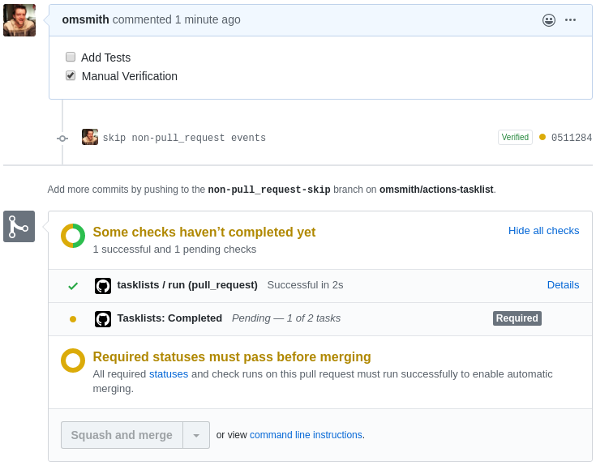
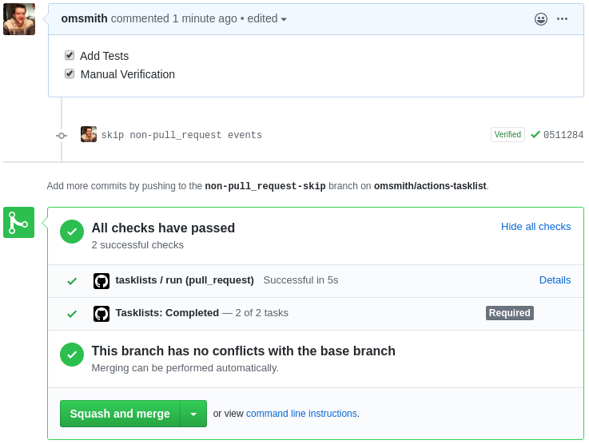
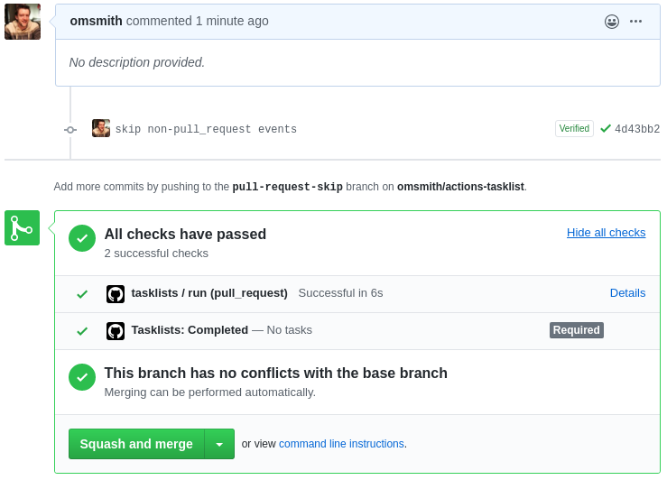
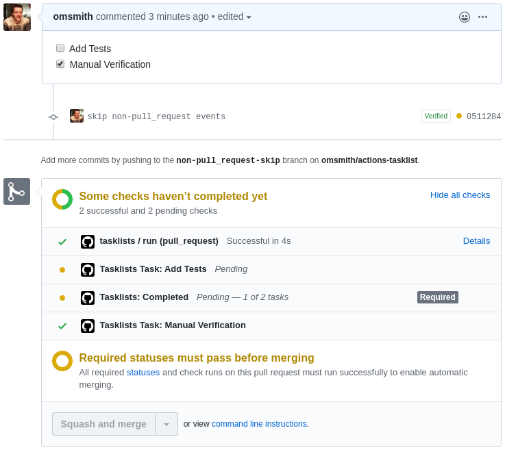

# Tasklists

This action turns the taskslist in a Pull Request into actionable PR statuses

## Usage

```yaml
on:
  pull_request:
    types: [opened, edited, synchronize]

jobs:
  tasklists:
    runs-on: ubuntu-latest
    steps:
      - uses: omsmith/actions-tasklists@v1
        with:
          # Token to used to authenticate to query and update Statuses
          #
          # Default: ${{ github.token }}
          github_token: ''

          # If enabled, individual tasks will be reported as statuses in
          # addition to the overall "Tasklists: Completed" status. You might
          # use this if your team has a particular "Definition of Done"
          # tasklist you want completed; allowing you to set the task items as
          # required statuses.
          #
          # Since statuses cannot be deleted, if tasks are removed they will be
          # reported as Errored.
          #
          # default: false
          report_tasks: true
```

### Selecting a version

It is recommended to use a major version tag of the action:

```yaml
uses: omsmith/actions-tasklists@v1
```

Other options include:
```yaml
# Specific version
# Not recommended as you won't get bug-fixes
uses: omsmith/actions-tasklists@v1.0.0

# Latest version
# Not recommended as major versions may break your workflow
uses: omsmith/actions-taskslists@latest
```

`master` _is_ not a built branch and will not function.


## Tasklists in action

### Pull Request with incomplete tasks



### Pull Request with complete tasks



### Pull Request without tasks



### Pull Request with report_tasks enabled


